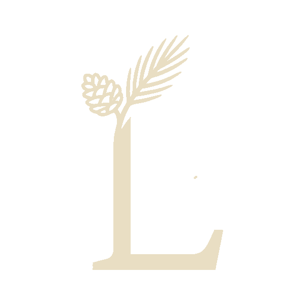
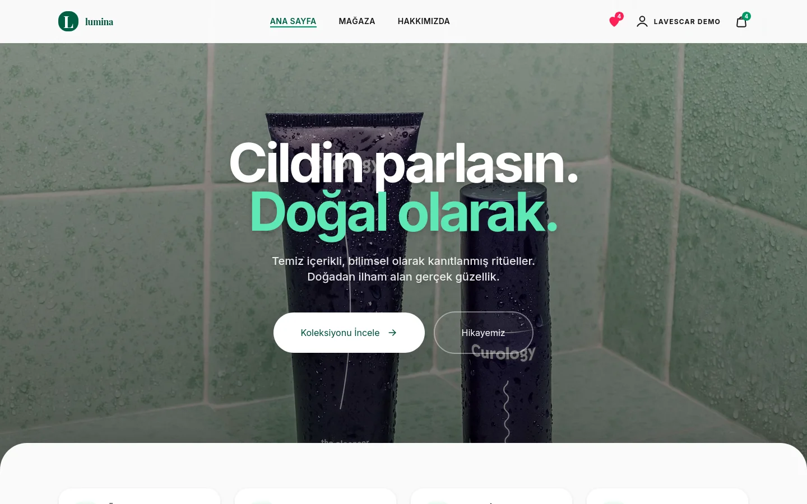
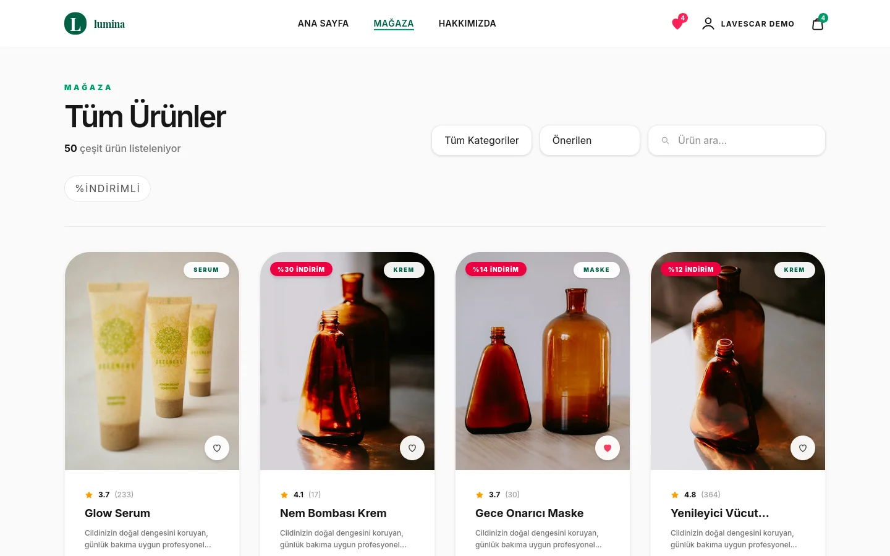
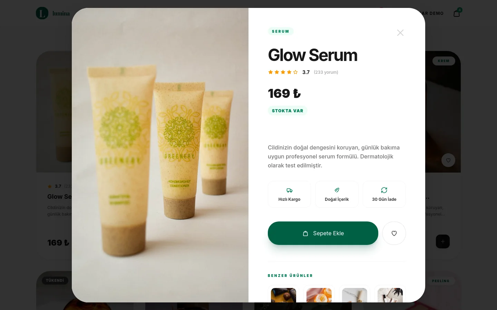
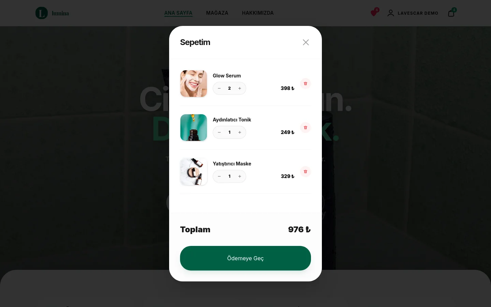
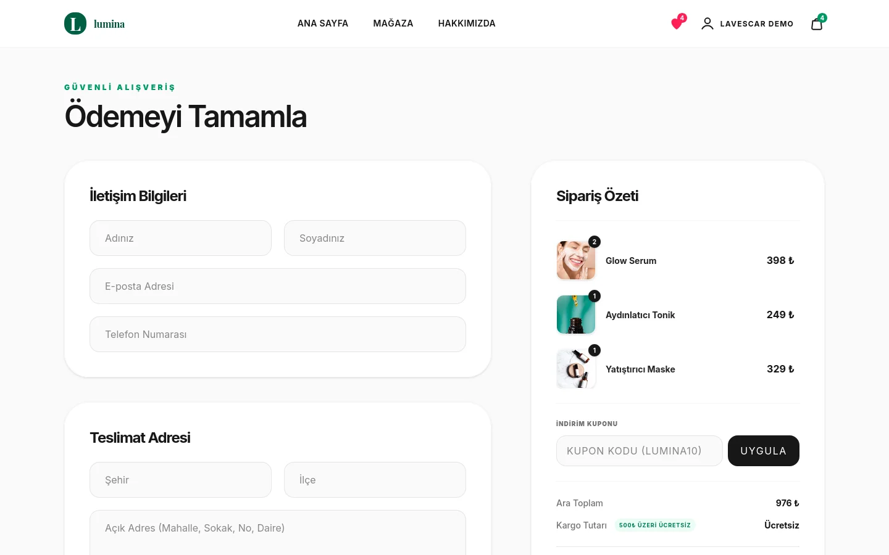
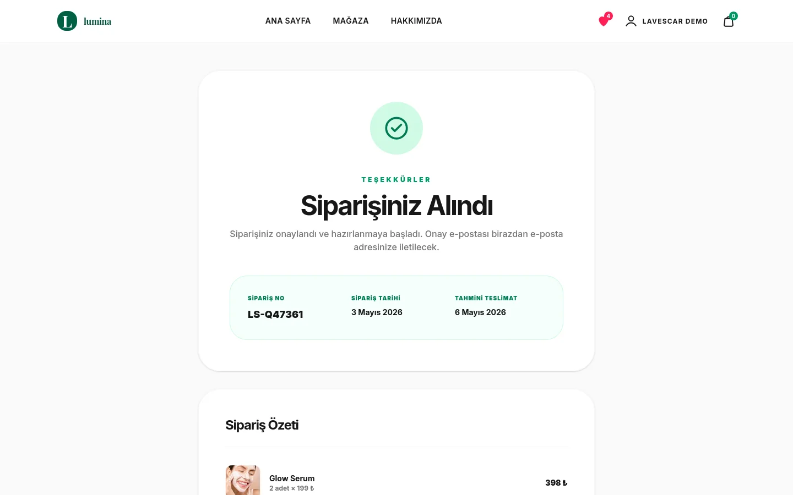
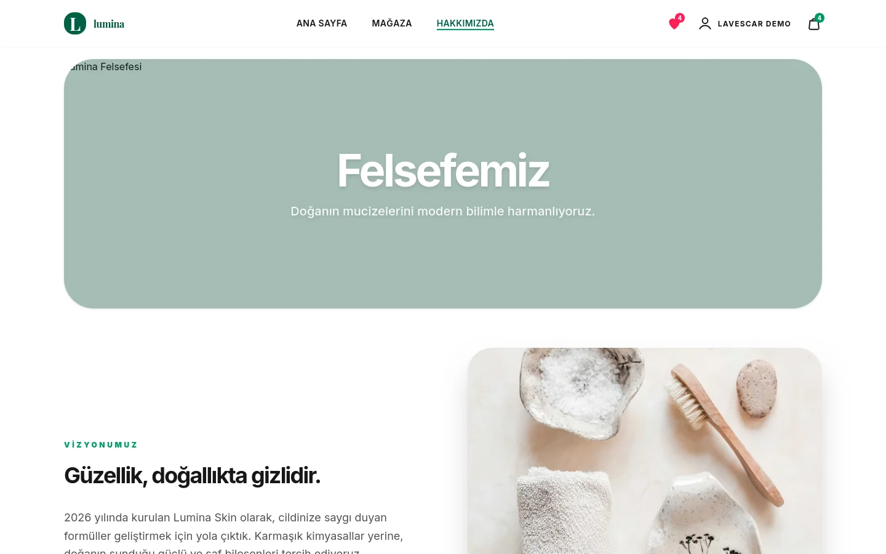
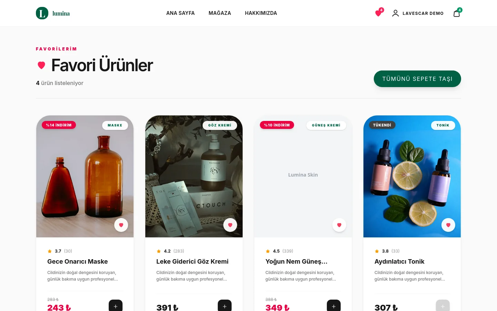

<div align="center">



# Lumina Skin Storefront

**Svelte + Vite + Tailwind ile sıfırdan inşa edilmiş skincare storefront demosu.** Ürün listeleme, modal ürün detayı, sepet, checkout, sipariş takibi, profil ve istek listesi — tamamen tarayıcı tarafında, `localStorage` ile sürekli kalıcılık.

[](#tech-stack)
[](https://lumina.lavescar.com.tr)
[](#license)

[**▸ Live demo**](https://lumina.lavescar.com.tr) · [**▸ Portfolyo**](https://lavescar.com.tr) · [**▸ Diğer demolar**](https://lavescar.com.tr/#projects)

</div>

---

<p align="center"></p>

## Genel bakış

Lumina, tek dosyalı bir HTML tasarımının modern bileşen tabanlı Svelte 5 yapısına taşınmış halidir. Görsel kimlik korunurken durum yönetimi Svelte reaktivitesine yeniden yazıldı; sepet, kullanıcı oturumu ve istek listesi `localStorage` ile sürekli kalıcılık sağlar. Backend gerektirmez — gerçek bir e-ticarete bağlamak isteyen ekipler için Rust/Axum tabanlı bir API katmanı eklenebilir.

## Özellikler

- **Ürün vitrini** — kategori filtreleri, ana sayfa öne çıkanlar
- **Ürün modal** — quick-view, beden/renk seçimi, sepete ekleme
- **Sepet paneli** — slide-out, miktar düzenleme, alt toplam
- **Checkout akışı** — adres + kart formu, sipariş özeti
- **Sipariş takibi** — durum aşamaları (hazırlanıyor → kargo → teslim)
- **Hakkımızda** — marka hikayesi sayfası
- **Profil + giriş** — modal authentication, oturum kalıcılığı
- **İstek listesi** — wishlist, ürün toggle ile heart icon

## Tech stack

| Layer | Technology |
|---|---|
| Framework | Svelte 5 (rune-based reactivity) |
| Build | Vite 7 |
| Styling | Tailwind CSS 4 (`@tailwindcss/vite` plugin) |
| State | Module-scoped `$state()` stores + `localStorage` |
| Images | Unsplash (uzaktan yüklenir) |
| Deploy | Cloudflare Pages |

## Ekran görüntüleri

<table>
  <tr>
    <td></td>
    <td></td>
  </tr>
  <tr>
    <td></td>
    <td></td>
  </tr>
  <tr>
    <td></td>
    <td></td>
  </tr>
  <tr>
    <td colspan="2"></td>
  </tr>
</table>

## Hızlı başlangıç

```bash
git clone https://github.com/Lavescar-dev/e-commerce.git
cd e-commerce/lumina-svelte

npm install
npm run dev          # → http://localhost:5173
```

Build:

```bash
npm run build        # → dist/
npm run preview      # built bundle önizleme
```

## Yapı

```
e-commerce/
└── lumina-svelte/        # Vite + Svelte workspace (canonical)
    ├── src/
    ├── public/
    └── package.json
```

## Backend ekleme

Mevcut sürüm tamamen browser-only çalışır. Gerçek bir e-ticarete bağlamak için:

- **Auth** — Argon2 + session token (örn. Rust/Axum, bkz. [vekalet](https://github.com/Lavescar-dev/vekalet))
- **Sepet/sipariş** — server-side persistence (PostgreSQL + Prisma veya Rust/sqlx)
- **Ödeme** — iyzico, Stripe Türkiye, PayTR

`localStorage` katmanı `src/stores/` içinde izole; aynı arayüzü implement eden bir HTTP istemcisi yazıp swap edilebilir.

## Deploy

Cloudflare Pages için doğrudan repo bağlanır:

| Field | Value |
|---|---|
| Build command | `cd lumina-svelte && npm install && npm run build` |
| Build output directory | `lumina-svelte/dist` |
| Node version | `20` |

## License

MIT © 2026 Lavescar

> Ürün görselleri Unsplash'tan demo amaçlı yüklenir.

---

<sub>Built by **[Lavescar](https://lavescar.com.tr)** · [Portfolyo](https://lavescar.com.tr/#projects) · [efe@lavescar.com.tr](mailto:efe@lavescar.com.tr)</sub>
